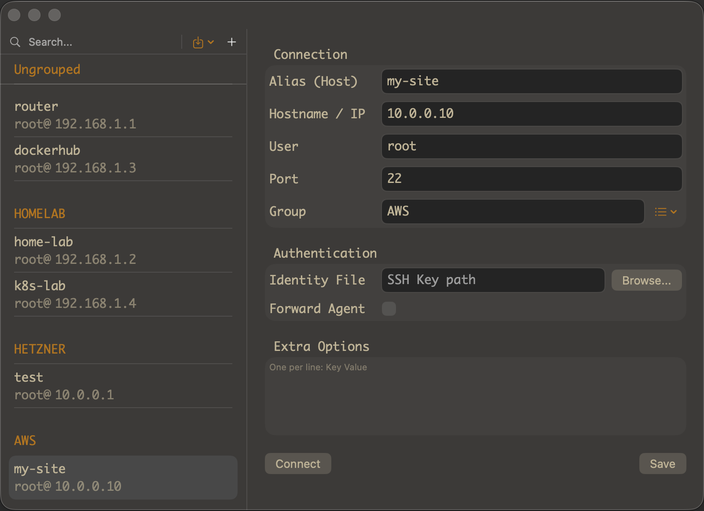
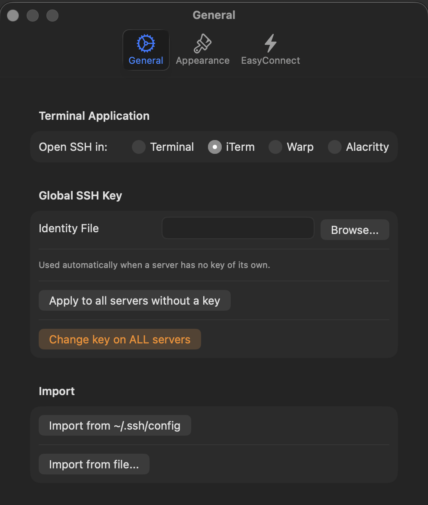
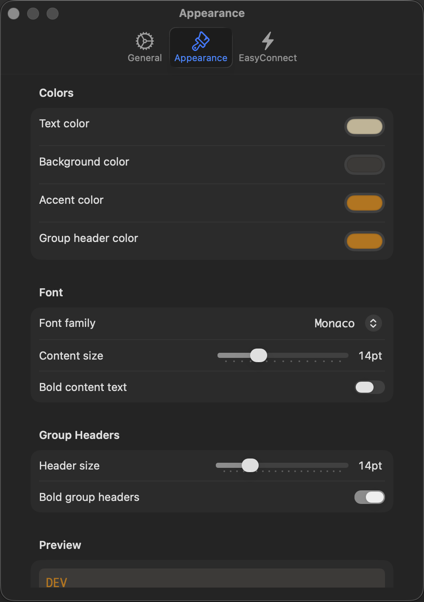
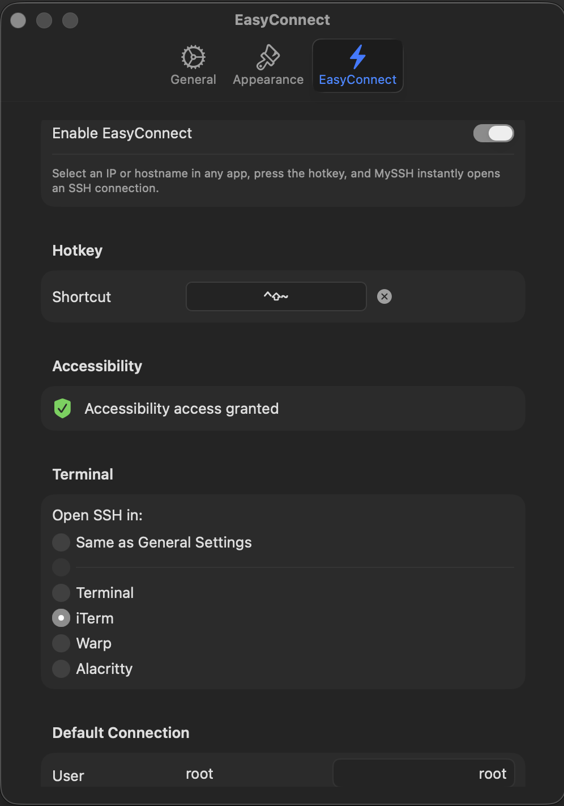

# MySSH — SSH менеджер для macOS

[English](README.md)

MacOS приложение для управления SSH подключениями. Выделите любой IP или хостнейм на экране — в браузере, логе или терминале — нажмите хоткей и подключитесь мгновенно. Импортируйте инфраструктуру из `~/.ssh/config` или Ansible inventory в один клик.



---

## Возможности

- **Подключение в один клик** — открывайте SSH сессию в выбранном терминале одним кликом
- **Список серверов** — организуйте подключения по группам с псевдонимами, хостами, пользователями, портами и ключами
- **EasyConnect** — выделите любой IP или хостнейм в любом приложении, нажмите хоткей, и SSH откроется мгновенно
- **Несколько терминалов** — поддержка Terminal.app, iTerm2, Warp и Alacritty; открывает во вкладке если терминал уже запущен
- **Импорт** — импорт хостов из `~/.ssh/config` или Ansible inventory файлов
- **Внешний вид** — настройте шрифты и цвета под себя
- **iCloud синхронизация** — список серверов хранится в iCloud Drive и доступен на всех ваших Mac

---

## Настройки

### Основные


### Внешний вид


### EasyConnect


---

## Установка

1. Скачай последний `MySSH.dmg` из [Releases](../../releases)
2. Открой DMG, перетащи **MySSH** в **Applications**
3. Запусти MySSH — появится в строке меню

> **EasyConnect** требует разрешения Accessibility. При первом использовании появится запрос — разреши доступ в **Системные настройки → Конфиденциальность и безопасность → Универсальный доступ**.

---

## EasyConnect

EasyConnect позволяет выделить IP адрес или хостнейм в любом месте — браузере, терминале, текстовом редакторе — и подключиться мгновенно по хоткею.

1. Открой **Настройки → EasyConnect**
2. Включи EasyConnect и задай хоткей (по умолчанию: `⌘⇧E`)
3. Разреши доступ к Accessibility когда появится запрос
4. Выдели любой IP или хостнейм в любом приложении и нажми хоткей

---

## Импорт

**Из `~/.ssh/config`:** Настройки → Основные → Import from ~/.ssh/config

**Из Ansible inventory:** кнопка импорта в тулбаре → Import from Ansible hosts...

```
[web_servers]
web1 ansible_host=192.168.1.10 ansible_user=ubuntu
web2 ansible_host=192.168.1.11
```

---

## Требования

- macOS 14 и новее
- Разрешение Accessibility (только для EasyConnect)

---

## Лицензия

MIT
